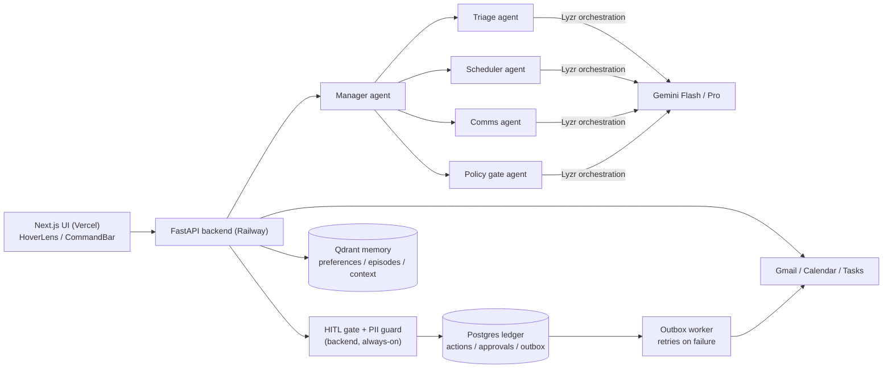

# Glance

A hover-first executive assistant for Gmail, Calendar and Tasks. Hover a message, event or task and it tells you what it would do and why — cites the policy it's acting on, or asks one question if it doesn't know your preference yet.

Live: https://glance-lake.vercel.app
Demo video: TBD

## What this is

Three inbox-style columns (mail, calendar, tasks) with a command bar on top. Everything the assistant does — archiving, scheduling, drafting, delegating — goes through a policy gate first: if it matches something you've told it before, it acts and shows you the policy it used. If not, it asks once, and remembers the answer.

## Architecture



A hover or command hits the FastAPI backend, which runs the instruction through the policy gate first (deterministic backend code, with its LLM sub-steps going through the Lyzr policy agent). If the gate needs more information it asks one question and stops; otherwise the manager agent decomposes the instruction into subtasks for triage/scheduler/comms, each of which reasons over Gemini via Lyzr. Anything gated (sends, deletes, moves involving an external attendee) routes to a Postgres-backed approval instead of executing. Every executed action writes a ledger row with a precomputed inverse before it touches Google; if the write fails, it drops into an outbox that retries on a timer.

## Stack

- **Gemini** — the reasoning behind every triage verdict, scheduling option, draft and policy decision. Flash on the hover path for latency, Pro for planning and drafting. Take it out and there's no brain behind any of this — just static inbox/calendar views.
- **Lyzr** — hosts and orchestrates the five agents (manager, triage, scheduler, comms, policy gate) and enforces their JSON output shape server-side (a bare `response_format` schema gets ignored; the OpenAI-style `json_schema` wrapper with `strict: true` is what actually works — see `DECISIONS.md`). HITL approvals, the PII guard, and trace IDs turned out to fit better as backend-owned code than as Lyzr platform features, so those live in Postgres and `app/governance/` instead — the branch the plan called for if Lyzr's own guardrails/HITL didn't cover it (spec §7.1). Take Lyzr out and there's no agent runtime or schema enforcement left; the reasoning has nowhere to run.
- **Qdrant** — memory. Preferences and past scheduling decisions live here with stable, idempotent IDs; a hybrid dense+sparse collection covers inbox search so triage can cite real context instead of guessing. Take it out and the assistant forgets everything between requests and asks the same question twice.

## Setup

Copy `.env.example` to `backend/.env` and fill in the values (see `EXECUTION_PLAN.md` locally for where each one comes from — not part of this repo).

```
cd backend
pip install -r requirements.txt
alembic upgrade head
uvicorn app.main:app --reload
```

```
cd frontend
npm install
npm run dev
```

Seed the demo account:

```
cd backend
python scripts/seed.py
python scripts/seed_memory.py
```

## Audit trail

Every action the assistant takes writes a row to the ledger before it reports success — actor, tool, operation, what authorized it (a policy, an instruction, or an approval), and a precomputed inverse so it can be undone. Sends are the one exception: irreversible, flagged as such, no undo.

## Guardrails

Anything that sends email, deletes an event, or moves an event onto/off an external attendee's calendar routes to an approval instead of executing outright. Outbound drafts get scanned for phone numbers, emails, card numbers and government IDs (regex plus a direct Gemini structured check) before the approval preview is even built — the redacted version is what actually goes out, never the original. A demo failure-mode flag can force every Gmail call to 401 to show the retry/outbox path live.

## Notes on the seed data

The demo account is a fictional ops lead ("Sam") at a company called Brightpath. The inbox has a couple of newsletters (auto-archive demo), a client request that needs delegating, and two calendar conflicts on purpose. Reseed any time with `POST /api/demo/reseed` (needs the `X-Demo-Token` header) — it wipes the inbox, calendar, tasks, ledger, and Qdrant memory back to the seeded baseline, so any preference learned live during a demo run doesn't linger into the next one.

## Known limits

- Single demo user — one shared Google account behind a stored refresh token, no per-visitor auth.
- The dashboard, approvals and audit views poll every few seconds (SWR) rather than pushing updates over a socket.
- Google OAuth is in Testing mode, so the consent screen shows an "unverified app" warning — expected, click through it.
- Hover latency depends on a background pre-warm firing when the dashboard loads; hovering within the first second or two of a fresh page load (or right after a reseed) can still hit a cold Lyzr/Gemini call before the cache catches up.
